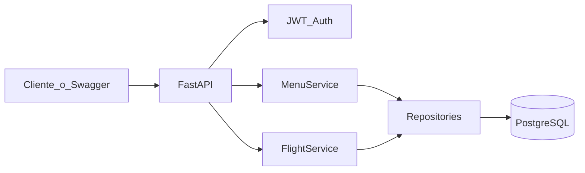

# Flight Menu API

API REST para gestionar **menús de comida a bordo** asociados a vuelos, con platillos en **español e inglés**.

---

## Qué es este proyecto

En operaciones de catering / aerolínea, cada ruta de vuelo necesita menús vigentes por fechas y ciclo (por ejemplo temporada), con platillos bilingües y control de disponibilidad.

Esta API permite:

- Crear, consultar, editar y eliminar (lógico) menús por vuelo
- Validar que un número de vuelo + ruta exista antes de operar
- Buscar menús por vuelo, fechas y estatus
- Cargar platillos en masa desde CSV o Excel

Fue desarrollada como prueba técnica de **Desarrollador Backend** (FastAPI + PostgreSQL).

---

## Qué incluye

**Requisitos del brief**

- CRUD de menús + búsqueda + validación de vuelos
- Arquitectura por capas (`routes` → `services` → `repositories` → `models`)
- Pydantic v2 (schemas de request y response separados)
- Paginación tipada (`items`, `totalRecords`, `totalPages`, `pageNumber`, `pageSize`)
- Errores HTTP (`400`, `404`, `409`, `422`, `500`)
- Configuración por variables de entorno (`.env`)

**Bonus**

- Docker Compose (dev y prod)
- Autenticación JWT (mock)
- Logging estructurado con `structlog` (JSON listo para CloudWatch)
- Tests con pytest (cobertura > 60%)
- Carga masiva de platillos CSV/Excel
- Migraciones con Alembic

---

## Cómo funciona



Flujo típico de uso:

1. Obtener token con `POST /api/v1/auth/login`
2. Validar vuelo con `POST /api/v1/flights/validate`
3. Crear menú con `POST /api/v1/menus` (usa el `flight_id` del paso 2)
4. (Opcional) Cargar platillos con `POST /api/v1/menus/{id}/dishes/upload` y un CSV/Excel
5. Listar, buscar, editar o hacer soft delete

Docs interactivas: [http://localhost:8000/docs](http://localhost:8000/docs)

---

## Modelo de datos

```text
flight 1──* menu 1──* dish
```

| Entidad | Campos principales |
|---------|-------------------|
| `flight` | `flight_number`, `departure_airport`, `arrival_airport`, `carrier` |
| `menu` | `flight_id`, `start_date`, `end_date`, `cycle`, `status`, `created_by`, `created_at`, `deleted_at` |
| `dish` | `meal_code`, `name_es`, `name_en`, `description_es`, `description_en`, `image_url`, `availability` |

Reglas relevantes:

- Un menú activo no puede duplicarse por `flight_id` + `start_date`
- El delete de menú es lógico (`deleted_at`); deja de aparecer en listados/búsqueda

---

## Stack

- Python 3.12 (compatible 3.11+)
- FastAPI + Pydantic v2
- SQLAlchemy 2.0 + PostgreSQL 16
- Alembic
- PyJWT + structlog
- Docker / Docker Compose
- pytest

---

## Arquitectura

Cada dominio sigue capas separadas:

`routes.py` (HTTP) → `services.py` (negocio) → `repositories.py` (SQL) → `models.py` (ORM)

Los schemas Pydantic de entrada (`*Create` / `*Update` / `*SearchRequest`) no se reutilizan como respuesta (`*Read` / `*Response`).

```text
app.py                 # factory FastAPI + routers
config.py              # settings desde .env
database.py            # engine / session / Base
dependencies.py        # DI (db, JWT user)
alembic/               # migraciones
core/
  auth/                # login JWT
  flights/             # validación de vuelos
  menus/               # menús + platillos + import CSV/Excel
  health/
  middleware/          # request logging
  logging_config.py
samples/               # CSV de ejemplo para carga masiva
scripts/seed_flights.py
tests/
```

---

## Quick start (local)

Postgres en Docker; la API en tu máquina.

### 1. Variables de entorno

```bash
cp .env.example .env
```

Por defecto la API apunta a Postgres en `localhost:5435`.

### 2. Base de datos

```bash
docker compose -f docker-compose.dev.yml up -d
docker compose -f docker-compose.dev.yml ps
# espera STATUS = healthy
```

### 3. API

```bash
python -m venv .venv
source .venv/bin/activate
pip install -r requirements.txt

alembic upgrade head
python app.py
```

- Swagger: [http://localhost:8000/docs](http://localhost:8000/docs)
- Health: `curl http://127.0.0.1:8000/api/v1/health`

### 4. Datos demo de vuelos

```bash
python scripts/seed_flights.py
```

| flight_number | ruta | carrier |
|---------------|------|---------|
| AM500 | MEX → CUN | AM |
| AM412 | MEX → GDL | AM |
| VB3207 | MTY → CUN | VB |
| Y4550 | MEX → TIJ | Y4 |

Usuario mock (`.env`): `admin` / `admin`.

---

## Demo rápida

```bash
# token
TOKEN=$(curl -s -X POST http://127.0.0.1:8000/api/v1/auth/login \
  -H "Content-Type: application/json" \
  -d '{"username":"admin","password":"admin"}' \
  | python -c "import sys,json; print(json.load(sys.stdin)['access_token'])")

# validar vuelo
curl -s -X POST http://127.0.0.1:8000/api/v1/flights/validate \
  -H "Authorization: Bearer $TOKEN" \
  -H "Content-Type: application/json" \
  -d '{"flight_number":"AM500","departure_airport":"MEX","arrival_airport":"CUN"}'

# crear menú (sustituye FLIGHT_ID)
curl -s -X POST http://127.0.0.1:8000/api/v1/menus \
  -H "Authorization: Bearer $TOKEN" \
  -H "Content-Type: application/json" \
  -d '{"flight_id":"<FLIGHT_ID>","start_date":"2026-09-01","end_date":"2026-09-15","cycle":"C1","status":"active","created_by":"demo","dishes":[]}'

# carga masiva de platillos (sustituye MENU_ID)
curl -s -X POST "http://127.0.0.1:8000/api/v1/menus/<MENU_ID>/dishes/upload" \
  -H "Authorization: Bearer $TOKEN" \
  -F "file=@samples/dishes_sample.csv"
```

Archivo de ejemplo: [`samples/dishes_sample.csv`](samples/dishes_sample.csv)

Columnas requeridas: `meal_code`, `name_es`, `name_en`  
Opcionales: `description_es`, `description_en`, `image_url`, `availability`

---

## Endpoints (`/api/v1`)

| Method | Path | Auth | Descripción |
|--------|------|------|-------------|
| GET | `/health` | No | Healthcheck |
| POST | `/auth/login` | No | Emite JWT |
| GET | `/menus` | Bearer | Lista menús (paginado) |
| POST | `/menus` | Bearer | Crea menú |
| GET | `/menus/{id}` | Bearer | Detalle con platillos |
| PUT | `/menus/{id}` | Bearer | Actualiza menú |
| DELETE | `/menus/{id}` | Bearer | Soft delete |
| POST | `/menus/search` | Bearer | Búsqueda con filtros |
| POST | `/menus/{id}/dishes/upload` | Bearer | Carga masiva CSV/Excel |
| POST | `/flights/validate` | Bearer | Valida vuelo + ruta |

Públicos: `/health`, `/auth/login`, docs OpenAPI.  
Protegidos: `/menus/*`, `/flights/validate`.

---

## Logging

Salida a stdout con **structlog**.

- Local: `LOG_JSON=false` (consola legible)
- CloudWatch / prod: `LOG_JSON=true` (JSON por línea)
- `LOG_LEVEL` por defecto `INFO`
- Cada request (excepto `/health`) lleva `X-Request-ID`

---

## Migraciones (Alembic)

```bash
alembic upgrade head
alembic current
alembic history
alembic revision --autogenerate -m "describe change"
alembic downgrade -1
```

Credenciales desde `.env` (`alembic/env.py`). En prod, `entrypoint.sh` ejecuta `alembic upgrade head` al arrancar.

---

## Tests

```bash
source .venv/bin/activate
pip install -r requirements.txt
pytest
```

Usa SQLite en memoria (`APP_ENV=test`). Gate de cobertura **> 60%** (`pytest.ini`).

---

## Producción (API + DB con Docker)

```bash
cp .env.example .env
# ajusta secretos (DB_PASSWORD, JWT_SECRET, etc.)

docker compose -f docker-compose.prod.yml up -d --build
```

Compose fuerza `DB_HOST=postgres`, `DB_PORT=5432` y `LOG_JSON=true` dentro del contenedor API.

| Service | Container | Puerto host |
|---------|-----------|-------------|
| `postgres` | `flight-menu-postgres-prod` | solo red interna |
| `api` | `flight-menu-api-prod` | `8000` |

```bash
docker compose -f docker-compose.prod.yml logs -f api
docker compose -f docker-compose.prod.yml down
```

---

## Docker files

| Archivo | Uso |
|---------|-----|
| `docker-compose.dev.yml` | Solo Postgres (host **5435**) |
| `docker-compose.prod.yml` | Postgres + API |
| `Dockerfile` / `Dockerfile.prod` | Imágenes de la API |
| `entrypoint.sh` | `alembic upgrade head` → uvicorn |
